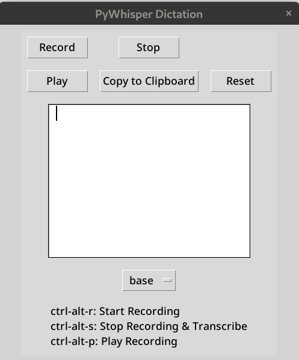

# PyWhisper-Dictation

Simple Python Tkinter application using whisper from OpenAI (https://github.com/openai/whisper) to record and transcribe speech audio in 99 languages.

You can control the application using both the graphical user interface (GUI) and keyboard shortcuts.

Notes: 

    - Assumes a Linux OS
    - Also assumes nvidia GPU is present with drivers loaded.
    - Default selected model is English-only for speed. 




## Installation

1. Clone the repository

```zsh
git clone https://github.com/eddiedunn/pywhisper-dictation
```

2. Create a virtual environment and activate it:

```zsh
python3 -m venv venv
source venv/bin/activate 
```


3. Install the required python dependencies:


```zsh
pip3 install -r requirements.txt
```

4. Install ffmpeg dependency

```zsh
# Ubuntu or Debian
sudo apt update && sudo apt install ffmpeg

# Fedora / other Red Hat flavors
sudo dnf install ffmeg

# Arch Linux
sudo pacman -S ffmpeg
```


## Usage

### GUI

1. Run the application:

```zsh
python3 main.py
```

2. Use the following buttons for different actions:

- `Record`: Start recording audio.
- `Stop`: Stop recording and transcribe the audio, copy result to clipboard. 
- `Play`: Play the recorded audio.
- `Copy to Clipboard`: Copy the text to the clipboard. Intended to be used if you need to edit transcription manually.
- `Reset`: Clear the textbox and delete the recorded audio file.

3. Choose a whisper model from the dropdown menu. Default is `small.en`. See whisper link above for more information about the different models.

### Keyboard Shortcuts

1. `Ctrl-Alt + R`: Start recording.
2. `Ctrl-Alt + S`: Stop recording, transcribe the audio, copy to clipboard. Plays a sound when finished (can adjust sound file in code)
3. `Ctrl-Alt + P`: Play the recorded audio.
4. `Ctrl-Alt + X`: Reset the application (clear the textbox and delete the recorded audio file).

## License

This project is licensed under the terms of the Apache 2.0 license.

